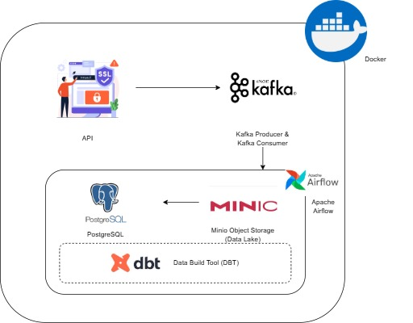

## `Objective`  

The project will stream events generated from a API and create a data pipeline that consumes the real-time data. The data would be processed in real-time and stored to the data lake periodically. The hourly batch job will then consume this data, apply transformations, and create the desired tables for our dashboard to generate analytics. 

## Architecture 

## Components & Processing Logic:

1. `API (Data Ingestion Point)`:
    The process begins with an API (Application Programming Interface). This is the entry point for the data.
2. `Kafka Producer & Kafka Consumer (Message Broker)` : 
    The data received by the API is then sent to Apache Kafka. Kafka is a distributed streaming platform that acts as a high-throughput, fault-tolerant message broker.

    Kafka Producer: The API acts as a Kafka Producer, sending data records (messages) into Kafka topics.

    Kafka Consumer: Concurrently, there are Kafka Consumers reading these messages from Kafka topics.
4. `Minio Object Storage (Data Lake)`:
    Minio is a high-performance, distributed object storage system, compatible with Amazon S3. It's labeled here as a "Data Lake." After data is consumed by Kafka, it's stored in Minio. Why i used data lake? Because the data will be have backup plan.
5. `PostgreSQL (Relational Database)`:
    - Data is loaded from the Minio Data Lake into PostgreSQL.  
    - On postgreSQL will be have 2 schema, ‘raw’ schema and ‘analytics’ schema.
    - The 'raw' schema is used to store raw data from Minio. The table in the raw schema will have  the following structure:
        - message_id TEXT PRIMARY KEY,   
        - room_id TEXT,
        - room_created_at TIMESTAMP,
        - channel TEXT,
        - customer_id TEXT,
        - customer_name TEXT,
        - phone TEXT,
        - sender_type TEXT,
        - message_text TEXT,
        - message_date TIMESTAMP
        - Upload_date TIMESTAMP
    - The 'analytics' schema will contain three tables: customers, rooms, and messages:
        
        Customers table 
            - customer_id VARCHAR(50) PRIMARY KEY,
            - customer_name VARCHAR(255),
            - phone VARCHAR(20),
            - created_at TIMESTAMP,

        Rooms table
            - room_id VARCHAR(50) PRIMARY KEY,
            - customer_id VARCHAR(50) REFERENCES customers,
            - channel VARCHAR(50),
            - room_created_at TIMESTAMP,
            - created_at TIMESTAMP
        
        Messages table 
            - message_id VARCHAR(50) PRIMARY KEY,
            - room_id VARCHAR(50) REFERENCES rooms,
            - sender_type VARCHAR(20),
            - message_text TEXT,
            - message_date TIMESTAMP,
            - created_at TIMESTAMP
6. `Airflow`
    In this project, Apache Airflow is used for scheduling and maintaining the data extracted from Minio to the PostgreSQL database. 
7. `DBT (Data Build Tools)`
    DBT is used to create data models from the 'raw' schema to the 'analytics' schema. 

## Technology Used
- Programming Language - Python
- Apache Kafka
- Minio
- Airflow
- DBT (Data Build Tools)
- Docker
